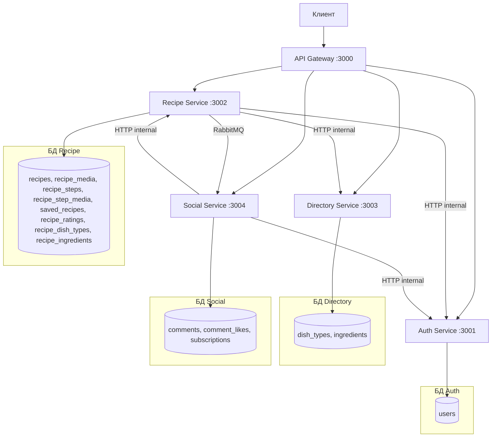

# Технический дизайн микросервисной архитектуры — Recipe Hub

## 1. Разделение монолита на микросервисы

Монолитное приложение разделяется на **4 микросервиса** + **API Gateway**, каждый со своей базой данных (database-per-service).

### 1.1. Auth Service
- **Назначение**: Регистрация, аутентификация, управление пользователями
- **Своя БД**: `users` (таблица users)
- **Порт**: 3001
- **Эндпоинты**:
  - `POST /auth/register` — регистрация
  - `POST /auth/login` — логин (выдача JWT)
  - `PATCH /users/me/password` — смена пароля
  - `GET /users` — список пользователей (admin)
  - `GET /users/me` — текущий пользователь
  - `PATCH /users/me` — обновление профиля
  - `DELETE /users/me` — удаление аккаунта
  - `GET /users/:userId` — получение пользователя
  - `DELETE /users/:userId` — удаление пользователя (admin)
  - `PATCH /users/:userId/role` — смена роли (admin)
  - `GET /internal/users/:userId` — внутренний эндпоинт для проверки существования пользователя
  - `GET /internal/users/:userId/role` — внутренний эндпоинт для проверки роли

### 1.2. Recipe Service
- **Назначение**: CRUD рецептов, шаги, медиа, рейтинги, сохранение рецептов
- **Своя БД**: `recipes`, `recipe_media`, `recipe_steps`, `recipe_step_media`, `saved_recipes`, `recipe_ratings`, `recipe_dish_types`, `recipe_ingredients`
- **Порт**: 3002
- **Эндпоинты**:
  - `GET /recipes` — поиск рецептов с фильтрацией
  - `POST /recipes` — создание рецепта
  - `GET /recipes/:recipeId` — получение рецепта
  - `PATCH /recipes/:recipeId` — обновление рецепта
  - `DELETE /recipes/:recipeId` — удаление рецепта
  - `GET /recipes/:recipeId/rating` — получение рейтинга
  - `PUT /recipes/:recipeId/rating` — оценка рецепта
  - `DELETE /recipes/:recipeId/rating` — удаление оценки
  - `GET /recipes/:recipeId/save` — проверка сохранения
  - `POST /recipes/:recipeId/save` — сохранить рецепт
  - `DELETE /recipes/:recipeId/save` — удалить из сохранённых
  - `GET /users/:userId/recipes` — рецепты пользователя
  - `GET /users/:userId/saved-recipes` — сохранённые рецепты пользователя
  - `GET /users/me/recipes` — свои рецепты
  - `GET /users/me/saved-recipes` — свои сохранённые
  - `GET /recipes/:recipeId/steps` — шаги рецепта
  - `POST /recipes/:recipeId/steps` — добавить шаг
  - `GET /recipes/:recipeId/steps/:stepId` — получить шаг
  - `PATCH /recipes/:recipeId/steps/:stepId` — обновить шаг
  - `DELETE /recipes/:recipeId/steps/:stepId` — удалить шаг
  - `GET /internal/recipes/:recipeId/author` — внутренний: проверка автора рецепта
  - `GET /internal/recipes/:recipeId/exists` — внутренний: проверка существования рецепта

### 1.3. Directory Service
- **Назначение**: Справочники (типы блюд, ингредиенты)
- **Своя БД**: `dish_types`, `ingredients`
- **Порт**: 3003
- **Эндпоинты**:
  - `GET /dish-types` — список типов блюд
  - `POST /dish-types` — создание типа блюда (admin)
  - `GET /dish-types/:dishTypeId` — получение типа блюда
  - `PATCH /dish-types/:dishTypeId` — обновление (admin)
  - `DELETE /dish-types/:dishTypeId` — удаление (admin)
  - `GET /ingredients` — список ингредиентов
  - `POST /ingredients` — создание ингредиента (admin)
  - `GET /ingredients/:ingredientId` — получение ингредиента
  - `PATCH /ingredients/:ingredientId` — обновление (admin)
  - `DELETE /ingredients/:ingredientId` — удаление (admin)

### 1.4. Social Service
- **Назначение**: Комментарии, лайки комментариев, подписки, лента
- **Своя БД**: `comments`, `comment_likes`, `subscriptions`
- **Порт**: 3004
- **Эндпоинты**:
  - `GET /recipes/:recipeId/comments` — комментарии рецепта
  - `POST /recipes/:recipeId/comments` — добавить комментарий
  - `GET /recipes/:recipeId/comments/:commentId` — получить комментарий
  - `PATCH /recipes/:recipeId/comments/:commentId` — обновить комментарий
  - `DELETE /recipes/:recipeId/comments/:commentId` — удалить комментарий
  - `GET /recipes/:recipeId/comments/:commentId/like` — проверка лайка
  - `POST /recipes/:recipeId/comments/:commentId/like` — лайкнуть
  - `DELETE /recipes/:recipeId/comments/:commentId/like` — убрать лайк
  - `GET /users/me/subscriptions` — свои подписки
  - `GET /users/me/subscribers` — свои подписчики
  - `GET /users/me/feed` — лента рецептов от подписок
  - `GET /users/:userId/subscribe` — проверка подписки
  - `POST /users/:userId/subscribe` — подписаться
  - `DELETE /users/:userId/subscribe` — отписаться
  - `GET /users/:userId/subscriptions` — подписки пользователя
  - `GET /users/:userId/subscribers` — подписчики пользователя

### 1.5. API Gateway
- **Назначение**: Единая точка входа (порт 3000), проксирование запросов к микросервисам, Swagger UI
- **Порт**: 3000
- **Функции**:
  - Проксирование HTTP-запросов к соответствующим сервисам
  - Swagger UI на `/api-docs`
  - Health check на `/health`

---

## 2. Взаимосвязь микросервисов и способы взаимодействия



### Способы взаимодействия:
1. **HTTP (REST) — синхронное взаимодействие**:
   - API Gateway → микросервисы: проксирование запросов
   - Recipe Service → Auth Service: проверка автора рецепта (isUserRecipeAuthor)
   - Recipe Service → Directory Service: проверка dishTypeIds/ingredientIds
   - Social Service → Auth Service: проверка пользователя/роли
   - Social Service → Recipe Service: проверка существования рецепта

2. **RabbitMQ — асинхронное взаимодействие**:
   - Recipe Service → Social Service: событие `recipe.created` при создании рецепта (для обновления ленты)

---

## 3. Разделение БД (database-per-service)

### 3.1. Auth Service — таблица `users`
| Колонка | Тип | Описание |
|---------|-----|----------|
| id | Int (PK) | ID пользователя |
| username | VarChar(255) | Уникальное имя |
| password_hash | VarChar(255) | Хеш пароля |
| first_name | VarChar(255) | Имя |
| last_name | VarChar(255) | Фамилия |
| about | Text | О себе |
| role | Enum(user, admin) | Роль |
| created_at | DateTime | Дата создания |
| updated_at | DateTime | Дата обновления |

### 3.2. Recipe Service — таблицы
- `recipes`: id, author_id, title, description, difficulty, is_published, created_at, updated_at
- `recipe_media`: id, recipe_id, sort_order, media_type, media_url, created_at, updated_at
- `recipe_steps`: id, recipe_id, number, title, description, created_at, updated_at
- `recipe_step_media`: id, recipe_step_id, sort_order, media_type, media_url, created_at, updated_at
- `saved_recipes`: id, user_id, recipe_id, saved_at (unique: user_id + recipe_id)
- `recipe_ratings`: id, user_id, recipe_id, rating, rated_at (unique: user_id + recipe_id)
- `recipe_dish_types`: id, dish_type_id, recipe_id (unique: dish_type_id + recipe_id)
- `recipe_ingredients`: id, ingredient_id, recipe_id (unique: ingredient_id + recipe_id)

### 3.3. Directory Service — таблицы
- `dish_types`: id, title, created_at, updated_at
- `ingredients`: id, title, created_at, updated_at

### 3.4. Social Service — таблицы
- `comments`: id, user_id, recipe_id, text, created_at, updated_at
- `comment_likes`: id, user_id, comment_id, liked_at (unique: user_id + comment_id)
- `subscriptions`: id, subscriber_id, subscribed_to_id, subscribed_at (unique: subscriber_id + subscribed_to_id)

---

## 4. Межсервисные эндпоинты (Internal API)

### Auth Service (Internal)
| Метод | Путь | Описание | Ответ |
|-------|------|----------|-------|
| GET | /internal/users/:userId | Проверка существования пользователя | `{ id, role }` или 404 |
| GET | /internal/users/:userId/role | Получение роли пользователя | `{ role }` или 404 |

### Recipe Service (Internal)
| Метод | Путь | Описание | Ответ |
|-------|------|----------|-------|
| GET | /internal/recipes/:recipeId/author | Проверка автора рецепта | `{ authorId }` или 404 |
| GET | /internal/recipes/:recipeId/exists | Проверка существования рецепта | `{ exists: true/false }` |

---

## 5. RabbitMQ — события

### Обменник: `recipe.events` (topic)

| Событие | Routing Key | Описание | Данные |
|---------|-------------|----------|--------|
| recipe.created | `recipe.created` | Создан новый рецепт | `{ recipeId, authorId, title, createdAt }` |

Social Service подписывается на `recipe.created` для потенциального обновления ленты.

---

## 6. Форматы запросов и ответов, ошибки

### Общий формат ошибки:
```json
{
  "message": "Описание ошибки"
}
```

### HTTP статус-коды:
- `200` — успех
- `201` — создано
- `204` — нет содержимого (удаление)
- `400` — ошибка валидации / бизнес-логики
- `401` — не авторизован (JWT отсутствует или недействителен)
- `403` — доступ запрещён (недостаточно прав)
- `404` — ресурс не найден

### Примеры запросов/ответов:

**Регистрация:**
```http
POST /api/auth/register
Content-Type: application/json

{
  "username": "chef123",
  "password": "secret123",
  "firstName": "Иван",
  "lastName": "Петров",
  "about": "Люблю готовить"
}
```
```http
201 Created
{
  "id": 1,
  "username": "chef123",
  "firstName": "Иван",
  "lastName": "Петров",
  "about": "Люблю готовить",
  "role": "user",
  "createdAt": "2026-06-27T10:00:00.000Z",
  "updatedAt": "2026-06-27T10:00:00.000Z"
}
```

**Логин:**
```http
POST /api/auth/login
Content-Type: application/json

{
  "username": "chef123",
  "password": "secret123"
}
```
```http
200 OK
{
  "user": { ... },
  "jwtToken": "eyJhbGciOiJIUzI1NiIs..."
}
```

**Создание рецепта:**
```http
POST /api/recipes
Authorization: Bearer <token>
Content-Type: application/json

{
  "title": "Борщ",
  "description": "Классический рецепт",
  "difficulty": "medium",
  "isPublished": true,
  "dishTypeIds": [1],
  "ingredientIds": [1, 2, 3],
  "media": [
    { "sortOrder": 1, "mediaType": "photo", "mediaUrl": "https://example.com/borsh.jpg" }
  ]
}
```
```http
201 Created
{
  "id": 1,
  "title": "Борщ",
  "dishTypes": [{ "id": 1, "title": "Суп" }],
  "ingredients": [{ "id": 1, "title": "Свёкла" }, ...],
  "description": "Классический рецепт",
  "media": [...],
  "difficulty": "medium",
  "createdAt": "...",
  "updatedAt": "...",
  "isPublished": true,
  "author": { ... }
}
```

---

## 7. Шаги для реализации

1. Создать корневую структуру проекта `recipe-hub/` с папками для каждого сервиса
2. Реализовать **Auth Service** с Prisma, Express, JWT
3. Реализовать **Directory Service** с Prisma, Express
4. Реализовать **Recipe Service** с Prisma, Express
5. Реализовать **Social Service** с Prisma, Express
6. Реализовать **API Gateway** с проксированием и Swagger
7. Настроить **RabbitMQ** (обменник `recipe.events`, событие `recipe.created`)
8. Написать **Dockerfile** для каждого сервиса
9. Написать **docker-compose.yml** для всех сервисов + RabbitMQ + PostgreSQL (4 БД)
10. Протестировать API-тестами